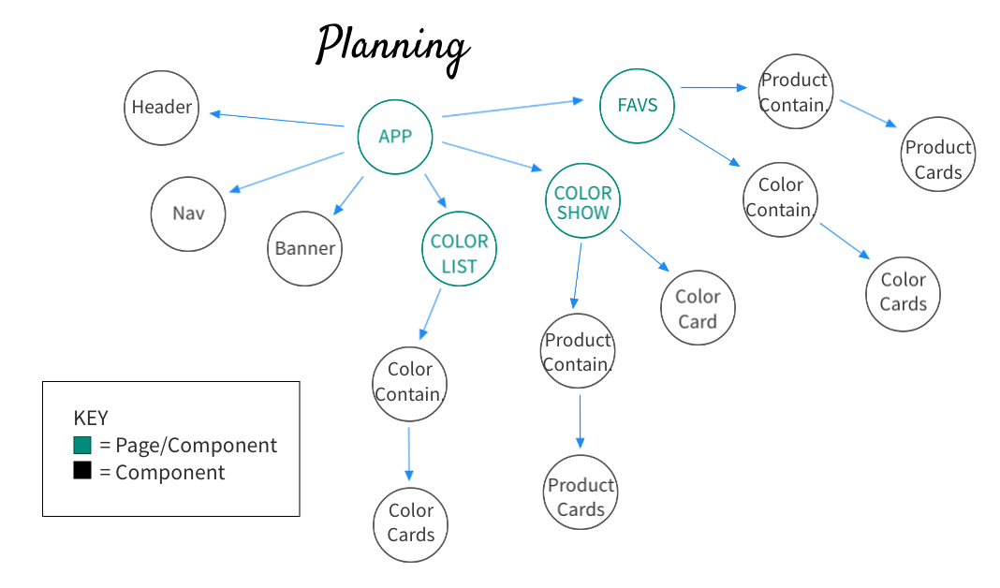
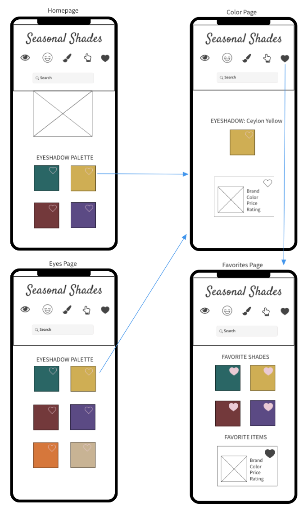

# Seasonal Shades

My inspiration for creating Seasonal Shades was to give makeup lovers color ideas who want to find the perfect shade of lipstick, blush, eyeshadow, or nailpolish. Users can browse colors by category or type in a color to see the instant matches via a fuzzy search. When a user clicks on a color, they are routed to a separate page and can see products that match that color with info including: name, brand, price, and website link.

### Set-Up Frontend:
- Clone this repo
- Run `npm install` from the root directory  
- Run `npm start` and visit localhost:3000 in your browser  

### Primary Technologies Used:
* React
* Redux
* React Router
* JavaScript
* CSS/SCSS
* API: http://makeup-api.herokuapp.com/

### Testing:
Jest and Enzyme
Run `npm test` from the root directory  

### Final App
- Screenshot goes here

### Original Assignment: 
[Binary Challenge](http://frontend.turing.io/projects/binary-challenge.html)  

### Component Planning:

### Wireframes:
#### Desktop View:

#### Mobile View:

### Future Enhancements:
- To do

This project was bootstrapped with [Create React App](https://github.com/facebook/create-react-app).
