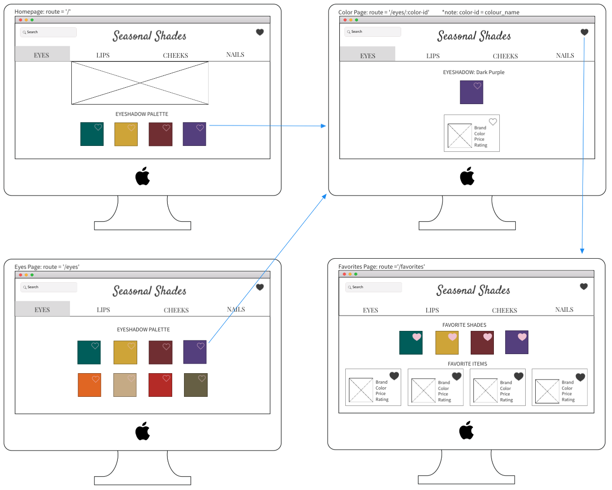
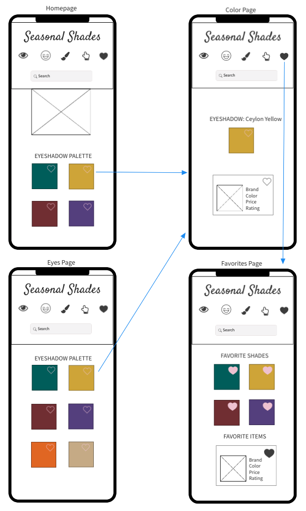

# Seasonal Shades

App description

### Set-Up Frontend:
- Clone this repo
- Run `npm install` from the root directory  
- Run `npm start` and visit localhost:3000 in your browser  

### Primary Technologies Used:
* React
* Redux
* React Router
* JavaScript
* CSS/SCSS
* API: http://makeup-api.herokuapp.com/

### Testing:
Jest and Enzyme
Run `npm test` from the root directory  

### Final App
- Screenshot goes here

### Original Assignment: 
[Binary Challenge](http://frontend.turing.io/projects/binary-challenge.html)  

### Wireframes:
#### Desktop View:

#### Mobile View:

This project was bootstrapped with [Create React App](https://github.com/facebook/create-react-app).

This section has moved here: https://facebook.github.io/create-react-app/docs/troubleshooting#npm-run-build-fails-to-minify
